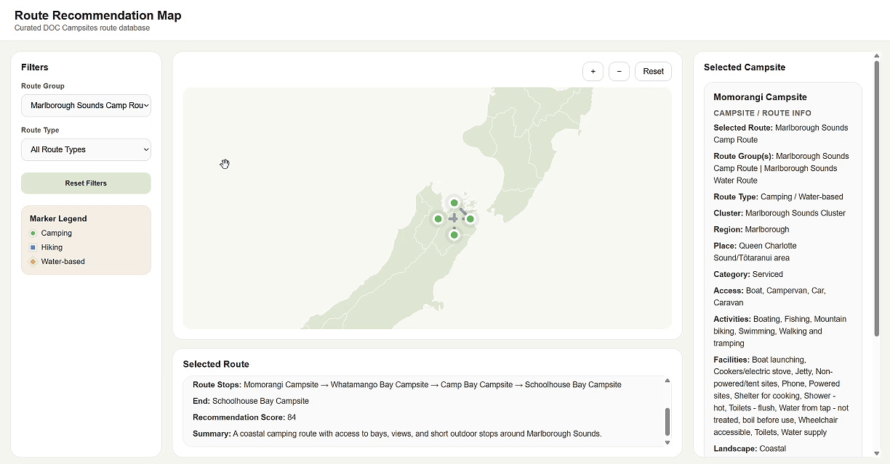
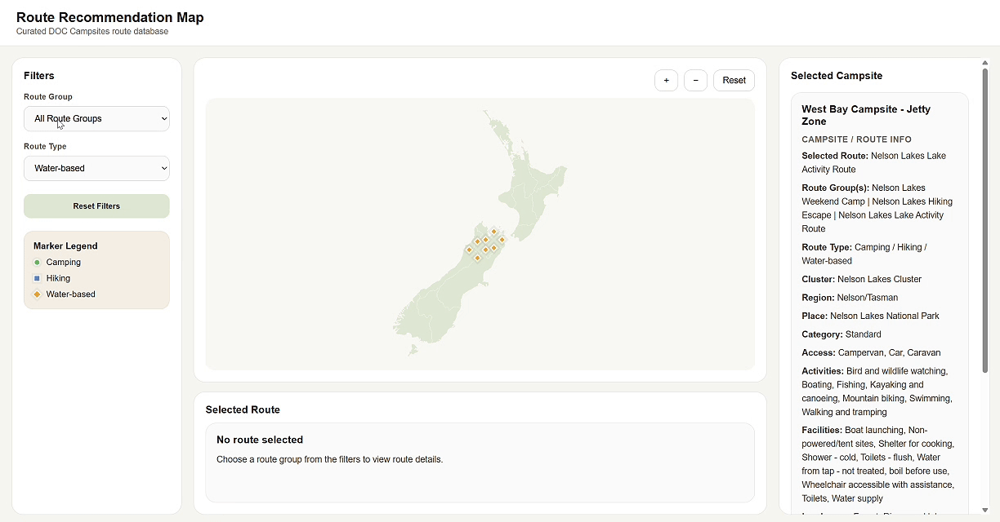

# Week 12

[← Back to Home](../index.md)

## Project Statement

Route Recommendation Map is a web-based interactive visualisation built from the Department of Conservation Campsites dataset in Aotearoa New Zealand. Rather than presenting all campsites as a neutral map, the project curates a smaller route database and reorganises campsites into selected camping, hiking, and water-based journeys. Users can filter routes, compare options, and view campsite details through an interface that combines mapping, categorisation, and recommendation.

This project utilises official, publicly available campsite data, including location, campsite category, access methods, facilities and site information. Building upon this raw data, I have created a curated database and developed a recommendation algorithm that relies on design judgement rather than external ratings. The criteria for evaluating routes include accessibility, activity suitability, facility conditions, and suitability for different users. As a result, the project is no longer merely a standard information tool, but has become a more selective and guiding system.

The theme explored by this work is not simply camping itself, but how public nature is organised and made ‘readable’ through data systems. It responds to a future scenario in which people increasingly understand natural spaces through digital filtering, administrative classifications and recommendation systems, rather than relying on local knowledge, personal memory or direct experience. In such a scenario, forests, lakes and campsites are no longer merely ‘places’, but environments defined by data.

From a critical perspective, this project examines how nature is classified, ranked and shaped within official information. Here, ‘recommendation’ is not a neutral function, but a mode of interpretation. By transforming campsite data into routes, rankings and filter results, this work seeks to make the judgements hidden within data systems visible.

The project aims to encourage viewers to question how environmental data influences their understanding of places. It does not merely help users choose a route; rather, it seeks to make viewers aware of how natural spaces are organised, compared and understood through data.

## Final Artefact

*This view shows the default state of the Route Recommendation Map. At this stage, the full curated dataset is visible on the map, allowing users to see the overall spatial distribution of the selected campsites across Aotearoa New Zealand. The left panel presents the available filtering controls, while the right panel displays detailed campsite information when a marker is selected. This opening state is important because it introduces the project as both a navigational interface and a critical visual system for reading public nature through data.*

*This view demonstrates campsite inspection at the individual marker level. By selecting a specific campsite, the interface reveals a more detailed information panel including route association, category, access, facilities, and other site data. This interaction highlights one of the central ideas of the project: that natural places are encountered not only as locations, but also as structured data records shaped by categorisation systems.*

*This view shows the interface after a specific route group has been selected. Instead of displaying the whole dataset equally, the map now focuses on one curated route and visually narrows the user’s attention to a smaller cluster of connected campsites. The route information panel below becomes more meaningful here, because it frames the selected sites as part of a designed journey rather than as isolated locations. This demonstrates the project’s shift from general campsite mapping to a curated route recommendation system.*

*This view demonstrates filtering by route type rather than by a named route group. Here, the interface isolates one recommendation category, allowing users to compare campsites through a shared activity logic rather than through a fixed journey. This makes the recommendation structure more legible, because users can begin to see how the system groups locations according to a specific type of use. It also reinforces the idea that filtering is not neutral, but a way of shaping how environmental space becomes understandable.*

*A comprehensive display*

[← Back to Home](../index.md)